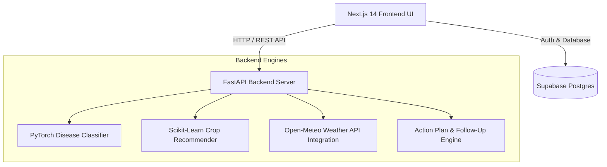

# KIsanIQ 🌾🤖
> **AI-Powered Farmer Decision Support System**  
> *"Don't just detect the problem. Decide what to do next."*

[](https://k-isan-iq.vercel.app)
[](https://nextjs.org/)
[](https://fastapi.tiangolo.com/)
[](https://pytorch.org/)

---

## 📌 Problem Statement & Solution

Smallholder farmers often face fragmented advice, generic weather updates, delayed disease diagnoses, and vague recommendations. Most apps stop at identifying a plant disease without offering an actionable, step-by-step recovery plan.

**KIsanIQ** solves this end-to-end:
1. **Detects** leaf diseases instantly using deep learning computer vision.
2. **Analyzes** local microclimate, soil NPK profiles, and weather risks.
3. **Generates** prioritized, actionable step-by-step resolution plans (chemical, biological, and cultural).
4. **Schedules** day-by-day follow-ups to track crop recovery over time.

---

## 🚀 Key Features

- 🌦️ **Weather Intelligence**: Real-time microclimate metrics, rainfall forecasts, humidity warnings, and tailored irrigation advice.
- 🔬 **AI Disease Doctor**: PyTorch computer vision model identifying crop diseases from leaf scans with high-confidence diagnostics & immediate treatment measures.
- 🌾 **Smart Crop Recommender**: Machine learning recommendation engine analyzing soil Nitrogen (N), Phosphorus (P), Potassium (K), pH levels, and climate conditions.
- ⚡ **Action Plan Generator**: Priority-ranked execution steps with exact chemical/organic dosages, safety guidelines, and timeline estimates.
- 📅 **Follow-Up & Monitoring**: Scheduled task tracking, multi-day progress check-ins, and dynamic strategy adjustments based on crop recovery response.
- 🛡️ **Demo Resilience Fallback**: Built-in mock data fallback handlers ensuring 100% smooth UI experience under any network condition.

---

## 🏗️ System Architecture



---

## 🛠️ Tech Stack

- **Frontend**: Next.js 14 (App Router), TypeScript, Tailwind CSS, Lucide Icons, Framer Motion
- **Backend**: FastAPI (Python 3.10), PyTorch, Scikit-Learn, Pandas, NumPy, Uvicorn
- **Database & Auth**: Supabase (PostgreSQL, Supabase Auth SSR)
- **Deployment**: Vercel (Frontend Hosting)

---

## 👥 Team

- **Aditi Mishra**
- **Janhavi Molkar**
- **Kanak Bais**
- **Yash Ratnaparkhi**

---

## 💻 Local Setup Instructions

### Prerequisites
- Node.js >= 18.x
- Python >= 3.10
- Git

### 1. Clone Repository
```bash
git clone https://github.com/Yashratnaparkhi-13/KIsanIQ.git
cd KIsanIQ
```

### 2. Backend Setup
```bash
cd backend
python3 -m venv venv
source venv/bin/activate
pip install -r requirements.txt
uvicorn app.main:app --reload --port 8000
```

### 3. Frontend Setup
```bash
cd ../frontend
npm install
npm run dev
```
Open [http://localhost:3000](http://localhost:3000) in your browser.

---

## 🧪 Testing

Run backend test suite:
```bash
cd backend
pytest -v
```

---

## 🔗 Live Application
🌐 **[https://k-isan-iq.vercel.app](https://k-isan-iq.vercel.app)**
