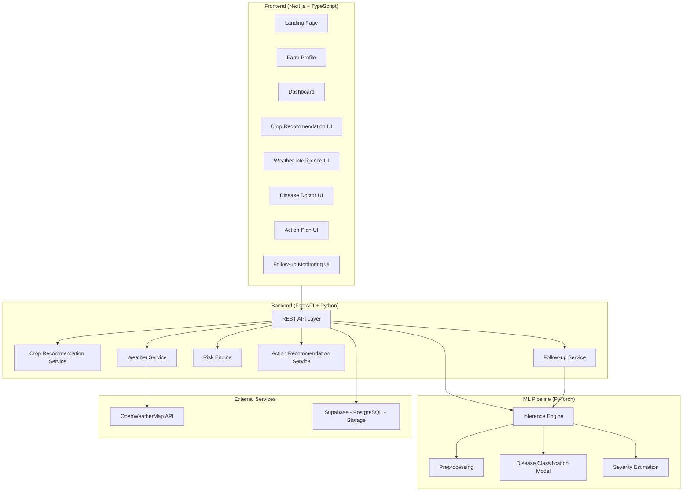
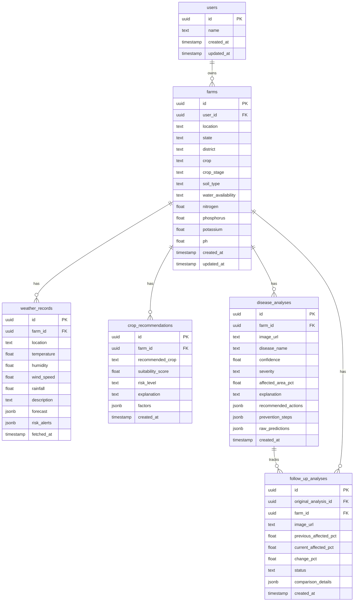
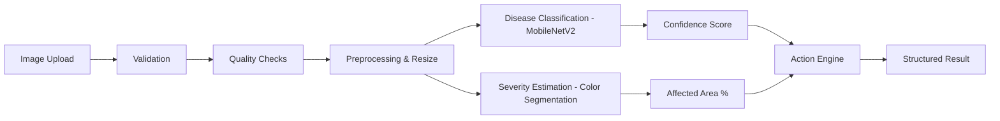
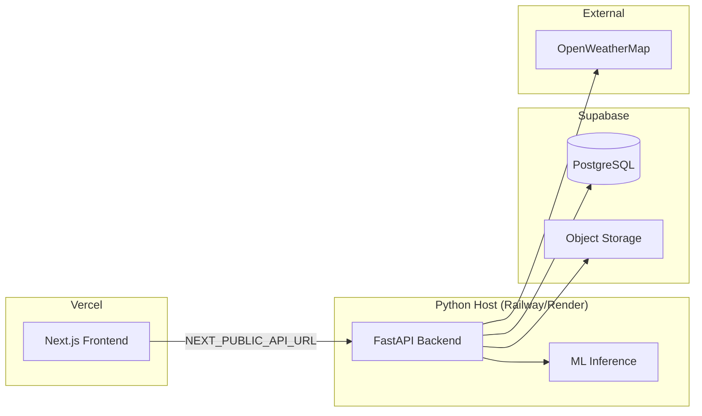

# KISANIQ — Implementation Plan

**AI-Powered Farmer Decision Support System**
**Hackathon: Morrow 1.0 | Team: 24mishraa-1**

---

## Architecture Overview



---

## Feature Breakdown (MVP)

| # | Feature | Layer | Priority |
|---|---------|-------|----------|
| 1 | Crop Recommendation | Backend rule engine | P0 |
| 2 | Weather Risk Awareness | Backend + OpenWeatherMap | P0 |
| 3 | Disease Image Analysis | ML + Backend | P0 |
| 4 | Severity + Action Guidance | ML + Backend decision engine | P0 |
| 5 | Follow-up Image Comparison | ML + Backend | P0 |

---

## Database Design (PostgreSQL / Supabase)



---

## API Contracts

| Method | Endpoint | Description |
|--------|----------|-------------|
| `GET` | `/health` | Health check |
| `POST` | `/api/farms` | Create farm profile |
| `GET` | `/api/farms/{farm_id}` | Get farm details |
| `POST` | `/api/crop-recommendation` | Get crop recommendation |
| `GET` | `/api/weather?state={state}&district={district}` | Get weather + risk |
| `POST` | `/api/disease/analyze` | Upload image, run inference |
| `POST` | `/api/follow-up/compare` | Compare follow-up image |
| `GET` | `/api/analyses/{farm_id}` | Get past analyses for farm |

**Standard Response:**
```json
{
  "success": true,
  "data": {},
  "error": null
}
```

---

## ML Pipeline



- **Architecture:** MobileNetV2 (transfer learning) — lightweight, mobile-deployment friendly
- **Dataset:** PlantVillage (publicly available, commonly used, ~54K images, 38 classes)
- **Severity:** OpenCV-based color segmentation for lesion area estimation
- **Inference:** Single model load at startup, async inference

---

## Environment Variables

```
# Database
DATABASE_URL=postgresql://...
SUPABASE_URL=https://...
SUPABASE_KEY=...
SUPABASE_SERVICE_KEY=...

# Weather
OPENWEATHERMAP_API_KEY=...

# Backend
BACKEND_HOST=0.0.0.0
BACKEND_PORT=8000
CORS_ORIGINS=http://localhost:3000

# ML
MODEL_PATH=ml/models/disease_model.pth
CONFIDENCE_THRESHOLD=0.6

# Frontend
NEXT_PUBLIC_API_URL=http://localhost:8000

# Demo
DEMO_MODE=false
```

---

## Development Phases

### Phase 1 — Foundation (Current)
- [x] Project structure (monorepo)
- [x] Git initialization + `.gitignore`
- [x] Frontend shell (Next.js + TypeScript + Tailwind)
- [x] Backend shell (FastAPI + Python)
- [x] Database schema (SQL migration)
- [x] Environment setup (`.env.example`)
- [x] Documentation skeleton

### Phase 2 — Farm Profile + Dashboard + Navigation
- [ ] Landing page
- [ ] Farm profile creation form
- [ ] Farm dashboard
- [ ] Responsive navigation
- [ ] Mobile-first layout

### Phase 3 — Weather Intelligence
- [ ] OpenWeatherMap integration
- [ ] Weather display UI
- [ ] Risk engine (weather → farming decisions)

### Phase 4 — Crop Recommendation
- [ ] Rule-based suitability engine
- [ ] Weighted factor scoring
- [ ] Crop recommendation UI

### Phase 5 — Disease ML Pipeline
- [ ] Dataset preparation (PlantVillage)
- [ ] Training script
- [ ] Evaluation script
- [ ] Inference API endpoint
- [ ] Image upload UI

### Phase 6 — Severity Estimation
- [ ] OpenCV color segmentation
- [ ] Affected area calculation
- [ ] Severity thresholds

### Phase 7 — Action Recommendation Engine
- [ ] Action plan service
- [ ] Context-aware recommendations
- [ ] Action plan UI

### Phase 8 — Follow-up Monitoring
- [ ] Follow-up image upload
- [ ] Comparison logic
- [ ] Before/After UI

### Phase 9 — Testing + Security + Performance
- [ ] Backend tests
- [ ] ML tests
- [ ] Frontend tests
- [ ] E2E test
- [ ] CORS, validation, rate limiting

### Phase 10 — Deployment + Docs + Demo
- [ ] Vercel frontend deployment config
- [ ] Backend deployment config
- [ ] Full README
- [ ] Architecture docs
- [ ] ML docs
- [ ] Demo scenarios

---

## Deployment Architecture



---

## Testing Strategy

| Layer | Tool | Coverage |
|-------|------|----------|
| Backend API | pytest + httpx | Health, CRUD, recommendation, weather, disease, follow-up |
| ML Pipeline | pytest | Preprocessing, inference, invalid images, confidence threshold |
| Frontend | Jest + React Testing Library | Components, user flows, error states |
| E2E | Playwright or Cypress | Full happy-path demo flow |

---

## Verification Plan

### Automated Tests
- `cd backend && pytest tests/ -v`
- `cd frontend && npm run lint && npm run typecheck && npm run build`
- `cd ml && pytest tests/ -v`

### Manual Verification
- Mobile layout at 360px, 390px, 412px widths
- Full demo flow (13 steps from spec)
- Image upload on mobile
- Weather data fetching with real API key
- Disease inference with test images

---

> [!IMPORTANT]
> **Open Questions for User:**
> 1. **Supabase Project:** Do you already have a Supabase project set up, or should I design for local PostgreSQL first and document Supabase migration?
> 2. **OpenWeatherMap API Key:** Do you have an API key ready, or should I implement with demo fallback first?
> 3. **ML Model Training:** Should I include a full training pipeline using PlantVillage, or use a pre-trained model for the hackathon and document the training pipeline?
> 4. **Tailwind CSS Version:** You mentioned Tailwind — shall I use Tailwind CSS v4 (latest) or v3?
